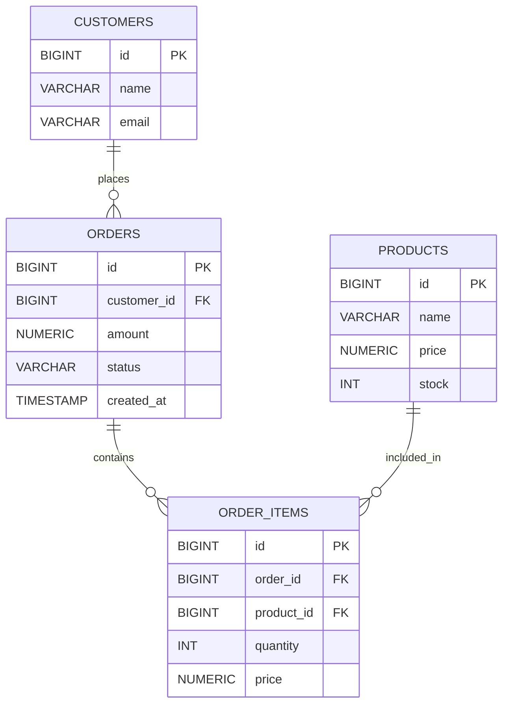

# Order Service - REST API enfoque DDD
 
## 📌 Descripción


`Order Service` es un servicio RESTful desarrollado con **Spring Boot**, siguiendo principios de **Domain-Driven Design (DDD)**.


Permite gestionar órdenes mediante operaciones básicas:


* Crear órdenes

* Consultar órdenes

* Consultar una orden por ID

* Actualizar órdenes


---
# Esquema de base de datos relacional

## Mermaid diagrams

 
 ## Database schema

```
CREATE TABLE customers (
    id BIGSERIAL PRIMARY KEY,
    name VARCHAR(255) NOT NULL,
    email VARCHAR(255) UNIQUE NOT NULL
);

CREATE TABLE products (
    id BIGSERIAL PRIMARY KEY,
    name VARCHAR(255) NOT NULL,
    price NUMERIC(10,2) NOT NULL,
    stock INT NOT NULL
);

CREATE TABLE orders (
    id BIGSERIAL PRIMARY KEY,
    customer_id BIGINT REFERENCES customers(id),
    amount NUMERIC(10,2),
    status VARCHAR(50),
    created_at TIMESTAMP DEFAULT CURRENT_TIMESTAMP
);

CREATE TABLE order_items (
    id BIGSERIAL PRIMARY KEY,
    order_id BIGINT REFERENCES orders(id),
    product_id BIGINT REFERENCES products(id),
    quantity INT NOT NULL,
    price NUMERIC(10,2) NOT NULL
);
```

## 📌 Estructuura del proyecto

```
 El proyecto está estructurado bajo el enfoque DDD (Domain-Driven Design):

 order-service/
├── src/main/java/com/example/orderservice/
│
│   ├── OrderServiceApplication.java
│
│   ├── domain/
│   │   └── order/
│   │       ├── model/
│   │       ├── repository/
│   │       ├── service/
│   │       └── exception/
│
│   ├── application/
│   │   └── order/
│   │       ├── exception/
│   │       ├── command/
│   │       └── usecase/
│   │       └── response/
│
│   ├── infrastructure/
│   │   ├── persistence/
│   │   │   ├── entity/
│   │   │   ├── repository/
│   │   │   └── mapper/
│   │   └── exception/
│
│   ├── interfaces/
│   │   └── rest/
│   │       ├── dto/
│   │       ├── mapper/
│   │       └── exception/
│
│   └── config/
│
├── src/main/resources/
│   └── application.yml
│
└── pom.xml

```

---

### 🔹 Capas


* **Interfaces**: expone endpoints REST (Controllers, DTOs)

* **Application**: orquesta casos de uso

* **Domain**: lógica de negocio pura

* **Infrastructure**: acceso a base de datos


---


## 🔄 Flujo (DDD)


El flujo de una petición sigue esta secuencia:

```

Controller → Mapper → Command → UseCase → Domain → Repository → DB

                                    ↓

                              Response → DTO → Controller

```

---


## 📡 Endpoints


### ➕ Crear Orden


**POST** `/orders`


#### Request


```json

{

  "customerId": 1,

  "items": [

    {

      "productId": 10,

      "quantity": 2,

      "price": 100

    }

  ]

}

```


#### Response


```json

{

  "orderId": 1,

  "status": "CREATED",

  "total": 1921.60

}

```

---


### 📋 Obtener todas las órdenes


**GET** `/orders`

#### Response


```json

{
    "orders": [
        {
            "customerId": 1,
            "orderId": 56,
            "status": "PENDING",
            "items": [
                {
                    "productId": 10,
                    "quantity": 10,
                    "price": 10.60
                },
                {
                    "productId": 5,
                    "quantity": 90,
                    "price": 12.40
                }
                
            ]
        }
    ]
}

```

---


### 🔍 Obtener orden por ID


**GET** `/orders/{id}`


#### Path Param


* `id`: ID de la orden


#### Response


```json

{
    "customerId": 1,
    "orderId": 52,
    "status": "CONFIRMED",
    "items": [
        {
            "productId": 10,
            "quantity": 76,
            "price": 10.60
        },
        {
            "productId": 5,
            "quantity": 90,
            "price": 12.40
        }
    ]
}

```

---


### ✏️ Actualizar Orden


**PUT** `/orders/{id}`


#### Request


```json

{

  "items": [

    {

      "productId": 20,

      "quantity": 3,

      "price": 200

    }

  ]

}

```

#### Response


```json
{
    "orderId": 52,
    "status": "PENDDING",
    "updateDate": "2026-06-08T21:54:18.316377"
}

```

---

##  Principios aplicados

* Separación de responsabilidades

* Dominio desacoplado de infraestructura

* Uso de DTOs para entrada/salida

* Casos de uso explícitos (UseCases)

* Mappers entre capas


---

## 📚 Documentación API


Swagger UI disponible en:

```

http://localhost:8080/swagger-ui.html

```

OpenAPI JSON:

```

http://localhost:8080/v3/api-docs

```

---


## 🚀 Tecnologías


* Java 17

* Spring Boot

* Spring Data JPA

* PostgreSQL

* Lombok

* OpenAPI / Swagger

---


## 🧪 Ejecución


```bash

mvn clean install

mvn spring-boot:run

```


---